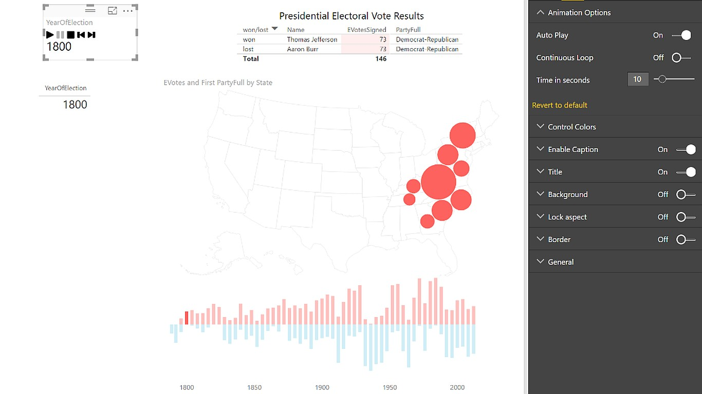

# Drilldown player

> Animates report components like a slicer on autopilot

# Overview

The Drilldown Player applies filters or selections to your report components automatically and supports three levels of hierarchy. You can choose to set the Player to start playing automatically when you open a report, as well as to continuously loop through its playback.

Just import the visual and put the fields you want to cycle through in the Category list and click the Play button. The Player will act like a slicer, filtering or selecting the other visuals on your page based on each field in turn. And if you drill down in the player, it will play through the next level down. 

A political campaign or other team can then use a report page as a continually-cycling “ticker” of what’s going on in their data.

This visual was built in conjunction with our partner [Gramener](http://gramener.com).

# Contributing

This project has adopted the [Microsoft Open Source Code of Conduct](https://opensource.microsoft.com/codeofconduct/). For more information see the [Code of Conduct FAQ](https://opensource.microsoft.com/codeofconduct/faq/) or contact [opencode@microsoft.com](mailto:opencode@microsoft.com) with any additional questions or comments.
